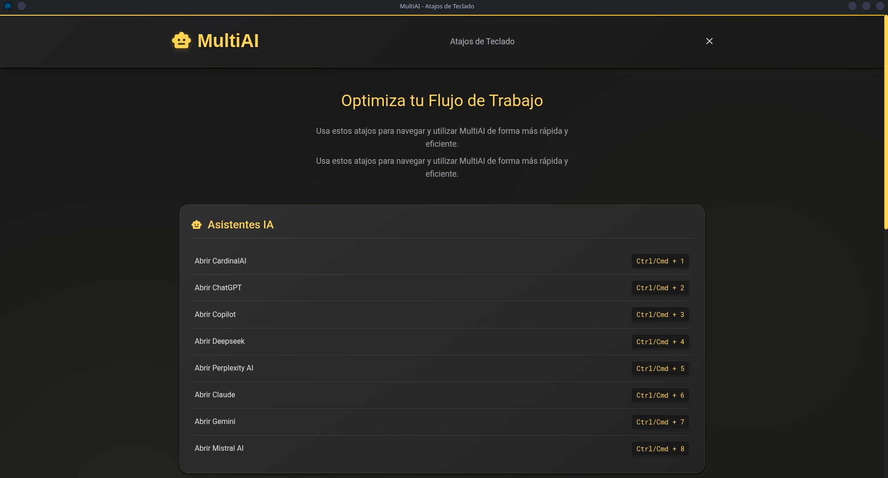
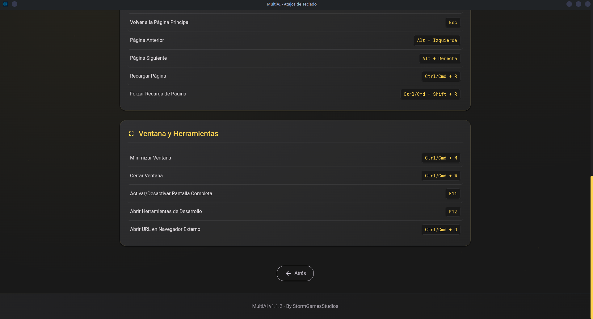
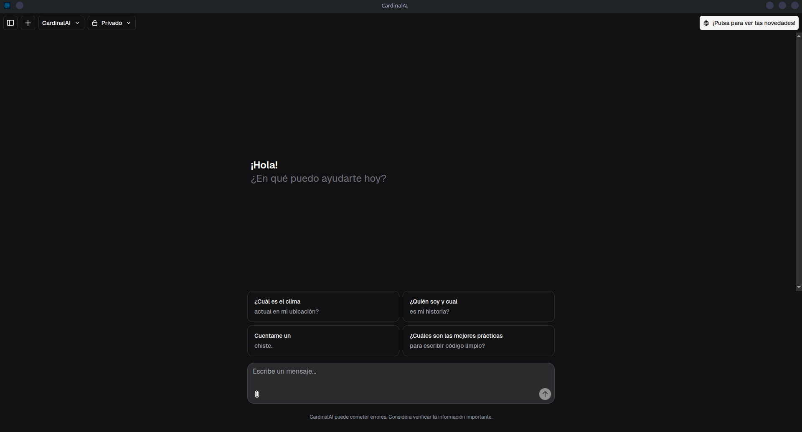
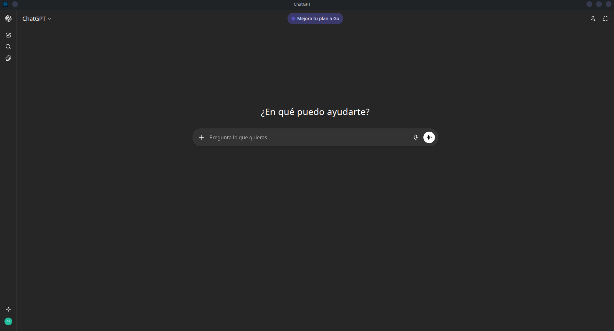

# MultiAI








---

## English

**Summary:** A unified desktop app that brings multiple AI models together in one clean and easy-to-use interface.

**Description:** MultiAI is a desktop application that lets you use different AI models from one place. It combines multiple AI providers into a single interface, making it easier to switch between models, send messages, manage conversations, and work more efficiently. The app is designed to be fast, simple, and user-friendly, offering a unified chat experience for all your AI tools.

### Installation

#### Via Repository (for .deb based systems like Debian, Ubuntu, etc.)

```bash
curl -fsSL https://raw.githubusercontent.com/acierto-incomodo/StormStore/main/install.sh | sudo bash
sudo apt install multiai
```

Snap:
[](https://snapcraft.io/multiai)

---

## Español

**Resumen:** Una aplicación de escritorio unificada que reúne múltiples modelos de IA en una interfaz limpia y fácil de usar.

**Descripción:** MultiAI es una aplicación de escritorio que te permite usar diferentes modelos de IA desde un solo lugar. Combina múltiples proveedores de IA en una única interfaz, facilitando el cambio entre modelos, el envío de mensajes, la gestión de conversaciones y un trabajo más eficiente. La aplicación está diseñada para ser rápida, sencilla y fácil de usar, ofreciendo una experiencia de chat unificada para todas tus herramientas de IA.

### Instalación

#### Vía Repositorio (para sistemas basados en .deb como Debian, Ubuntu, etc.)

```bash
curl -fsSL https://raw.githubusercontent.com/acierto-incomodo/StormStore/main/install.sh | sudo bash
sudo apt install multiai
```

Snap:
[](https://snapcraft.io/multiai)